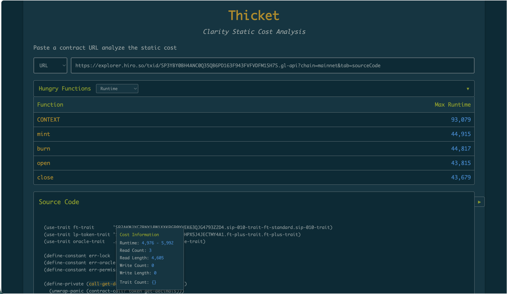

# Thicket

An application for viewing static cost analysis of Clarity smart contracts

## Features

- Analyzes Clarity contracts to break down static costs (runtime, read/write counts, read/write lengths) for each function
  - Paste contract source code directly or provide an explorer url to the Clarity source
- Hover over function names in the source code to view detailed cost breakdowns

## Usage

1. Start the server:

   ```bash
   cargo run
   ```

2. Open `http://localhost:3000` in your browser

3. Choose input type (URL or Source Code) and analyze your Clarity contract


